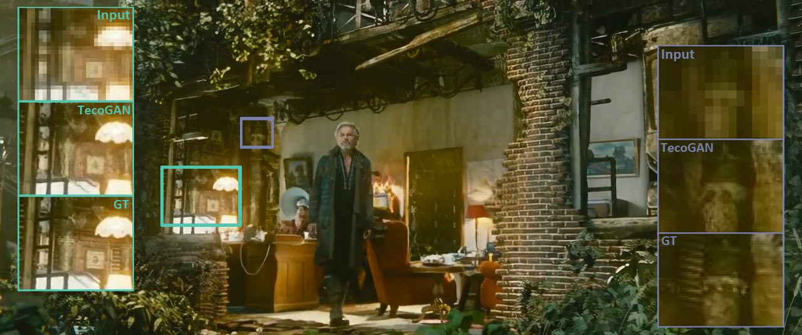
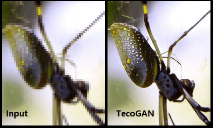
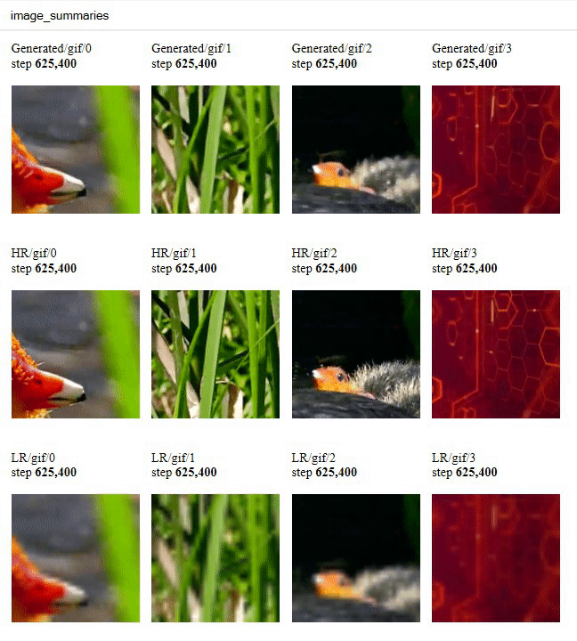

# TecoGAN
This repository contains source code and materials for the TecoGAN project, i.e. code for a TEmporally COherent GAN for video super-resolution.
_Authors: Mengyu Chu, You Xie, Laura Leal-Taixe, Nils Thuerey. Technical University of Munich._

This repository so far contains the code for the TecoGAN _inference_ and _training_, and downloading the training data.
Pre-trained models are also available below, you can find links for downloading and instructions below.
This work was published in the ACM Transactions on Graphics as "Learning Temporal Coherence via Self-Supervision for GAN-based Video Generation (TecoGAN)", https://doi.org/10.1145/3386569.3392457. The video and pre-print can be found here:

Video: <https://www.youtube.com/watch?v=pZXFXtfd-Ak>
Preprint: <https://arxiv.org/pdf/1811.09393.pdf>
Supplemental results: <https://ge.in.tum.de/wp-content/uploads/2020/05/ClickMe.html>



### Additional Generated Outputs

Our method generates fine details that 
persist over the course of long generated video sequences. E.g., the mesh structures of the armor,
the scale patterns of the lizard, and the dots on the back of the spider highlight the capabilities of our method.
Our spatio-temporal discriminator plays a key role to guide the generator network towards producing coherent detail.

<br>

<br>

<br>

### Running the TecoGAN Model

Below you can find a quick start guide for running a trained TecoGAN model.
For further explanations of the parameters take a look at the runGan.py file.  
Note: evaluation (test case 2) currently requires an Nvidia GPU with `CUDA`. 
`tkinter` is also required and may be installed via the `python3-tk` package.

```bash
# Install tensorflow1.8+,
pip3 install --ignore-installed --upgrade tensorflow-gpu # or tensorflow
# Install PyTorch (only necessary for the metric evaluations) and other things...
pip3 install -r requirements.txt

# Download our TecoGAN model, the _Vid4_ and _TOS_ scenes shown in our paper and video.
python3 runGan.py 0

# Run the inference mode on the calendar scene.
# You can take a look of the parameter explanations in the runGan.py, feel free to try other scenes!
python3 runGan.py 1 

# Evaluate the results with 4 metrics, PSNR, LPIPS[1], and our temporal metrics tOF and tLP with pytorch.
# Take a look at the paper for more details! 
python3 runGan.py 2

```

### Train the TecoGAN Model

#### 1. Prepare the Training Data

The training and validation dataset can be downloaded with the following commands into a chosen directory `TrainingDataPath`.  Note: online video downloading requires youtube-dl.  

```bash
# Install youtube-dl for online video downloading
pip install --user --upgrade youtube-dl

# take a look of the parameters first:
python3 dataPrepare.py --help

# To be on the safe side, if you just want to see what will happen, the following line won't download anything,
# and will only save information into log file.
# TrainingDataPath is still important, it the directory where logs are saved: TrainingDataPath/log/logfile_mmddHHMM.txt
python3 dataPrepare.py --start_id 2000 --duration 120 --disk_path TrainingDataPath --TEST

# This will create 308 subfolders under TrainingDataPath, each with 120 frames, from 28 online videos.
# It takes a long time.
python3 dataPrepare.py --start_id 2000 --duration 120 --REMOVE --disk_path TrainingDataPath


```

Once ready, please update the parameter TrainingDataPath in runGAN.py (for case 3 and case 4), and then you can start training with the downloaded data! 

Note: most of the data (272 out of 308 sequences) are the same as the ones we used for the published models, but some (36 out of 308) are not online anymore. Hence the script downloads suitable replacements.


#### 2. Train the Model  
This section gives command to train a new TecoGAN model. Detail and additional parameters can be found in the runGan.py file. Note: the tensorboard gif summary requires ffmpeg.

```bash
# Install ffmpeg for the  gif summary
sudo apt-get install ffmpeg # or conda install ffmpeg

# Train the TecoGAN model, based on our FRVSR model
# Please check and update the following parameters: 
# - VGGPath, it uses ./model/ by default. The VGG model is ca. 500MB
# - TrainingDataPath (see above)
# - in main.py you can also adjust the output directory of the  testWhileTrain() function if you like (it will write into a train/ sub directory by default)
python3 runGan.py 3

# Train without Dst, (i.e. a FRVSR model)
python3 runGan.py 4

# View log via tensorboard
tensorboard --logdir='ex_TecoGANmm-dd-hh/log' --port=8008

```

### Tensorboard GIF Summary Example
<br>

### Acknowledgements
This work was funded by the ERC Starting Grant realFlow (ERC StG-2015-637014).  
Part of the code is based on LPIPS[1], Photo-Realistic SISR[2] and gif_summary[3].

### Reference
[1] [The Unreasonable Effectiveness of Deep Features as a Perceptual Metric (LPIPS)](https://github.com/richzhang/PerceptualSimilarity)  
[2] [Photo-Realistic Single Image Super-Resolution Using a Generative Adversarial Network](https://github.com/brade31919/SRGAN-tensorflow.git)  
[3] [gif_summary](https://colab.research.google.com/drive/1vgD2HML7Cea_z5c3kPBcsHUIxaEVDiIc)

TUM I15 <https://ge.in.tum.de/> , TUM <https://www.tum.de/>
